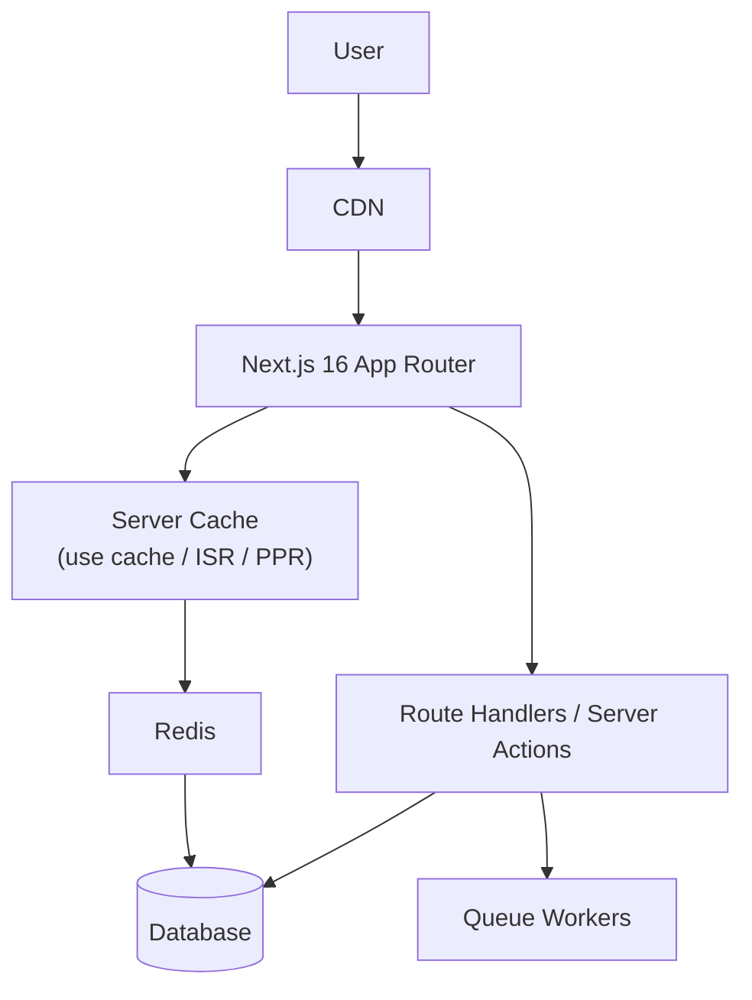
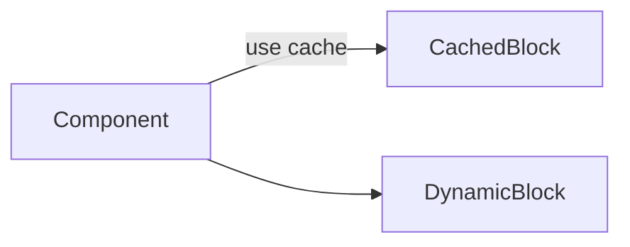
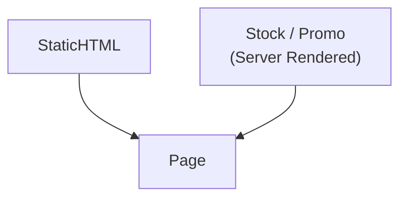
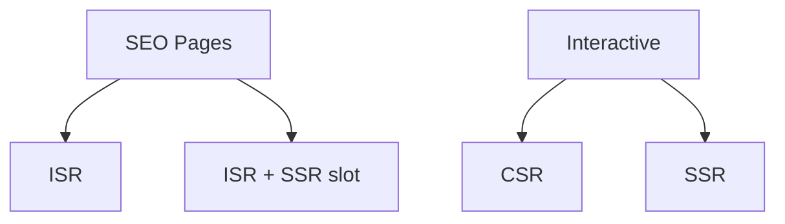
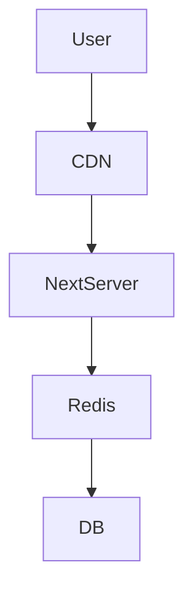
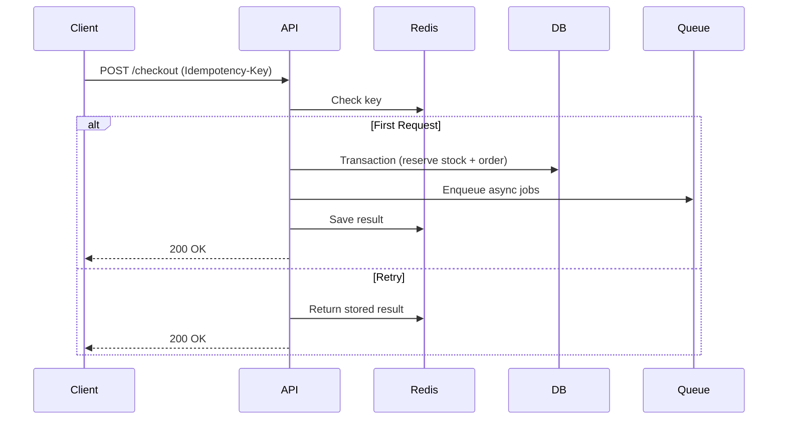
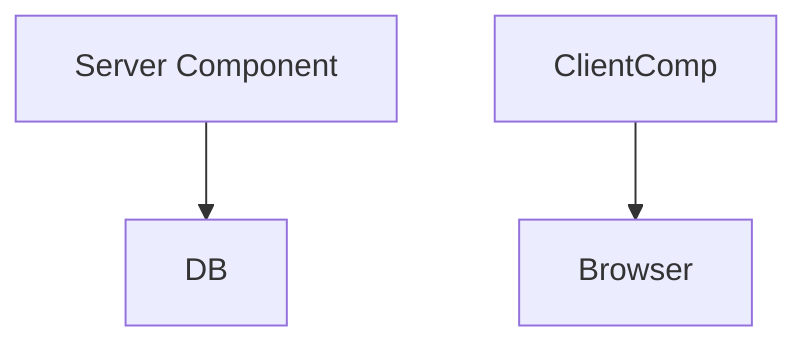
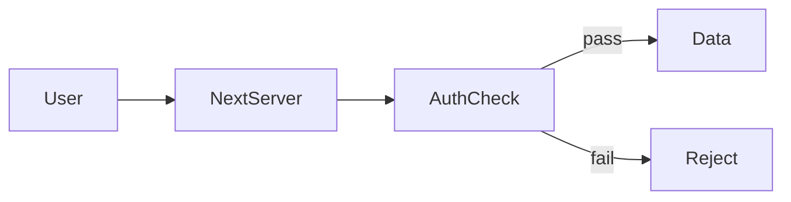
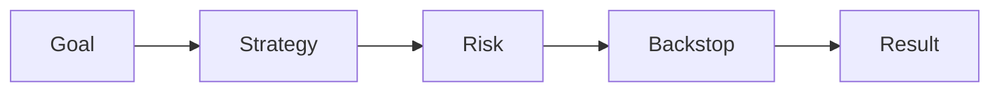

# 🚀 Next.js 16 面試衝刺（1.5 天）— 電商架構完整實戰版

> 這份文件用「電商網站」完整覆蓋 Next.js 16 面試高頻題  
> 包含：渲染策略、PPR、Cache 設計、併發控制、DB 一致性、安全設計  
> 所有圖示已內嵌（Mermaid）

---

# 🎯 一句話架構（面試開場 20 秒）

我會把電商系統拆成：

- SEO 關鍵頁 → ISR / PPR
- 即時變動資料 → SSR slot
- 高互動區塊 → CSR
- 讀多寫少 → 三層 Cache
- 高併發寫入 → Idempotency + Transaction + Queue

---

# 🏗 整體系統架構圖

---

# 1️⃣ Next.js 16 核心特性

---

## 🔹 Cache Components (`"use cache"`)

- 明確 opt-in 快取
- 不再隱式快取
- 可控制 TTL
- 可局部動態

### 示意圖

---

## 🔹 PPR（Partial Prerendering）

同一頁面：

- Static 區塊（立即輸出）
- Dynamic 區塊（Suspense）

---

## 🔹 Turbopack

- 更快 dev server
- 更快 build

---

## 🔹 React Compiler Support

- 自動 memoization
- 仍需 profiler 驗證

---

# 2️⃣ 電商頁面渲染策略（面試必考）

---

## 🛍 商品列表 `/category/[slug]`

目標：

- SEO
- 快速首屏

策略：

- ISR（revalidate 60~300 秒）
- PPR（價格區塊動態）

---

## 📦 商品詳情 `/product/[id]`

策略：

- 基本資料 → ISR
- 庫存/價格 → SSR

---

## 🛒 購物車 `/cart`

- CSR
- Optimistic UI
- Checkout 前 server revalidate

---

## 💳 Checkout `/checkout`

- SSR / Server Actions
- 金額 server 計算
- Idempotency 防重送

---

## 📊 渲染總覽圖

---

# 3️⃣ 三層快取架構（面試高頻）

---

## Layer 1 — CDN

- 靜態 HTML
- JSON cache

---

## Layer 2 — Next Server Cache

- use cache
- ISR

---

## Layer 3 — Redis Cache

- Cache-aside
- TTL + Jitter
- 防止雪崩

---

## 三層快取圖

---

# 🔥 Cache Invalidation

### Cache-aside

讀 miss → DB → set cache  
寫 DB → 刪 key

---

### 防止雪崩

- Singleflight
- 隨機 TTL
- Stale-while-revalidate

---

# 4️⃣ API 高併發設計

---

# 🔹 大量 GET

優先：

1. CDN
2. Next server cache
3. Redis
4. DB replica

---

# 🔹 大量 POST（下單）

核心：

- Idempotency key
- Transaction
- Unique constraint
- Queue

---

## 💳 下單流程

---

# 5️⃣ 交易一致性設計

---

## 樂觀鎖

- version column

## 悲觀鎖

- SELECT ... FOR UPDATE

---

## Unique Constraint 防重複扣款

- payment_intent_id UNIQUE

---

# 6️⃣ Server vs Client Components

---

Server Component：

- 可直接存取 DB
- 無 client JS

Client Component：

- `use client`
- 僅互動區塊

---

---

# 7️⃣ Middleware / Runtime

Edge Runtime：

- 快
- 無 Node API

Node Runtime：

- 可用完整 Node API

---

# 8️⃣ 安全設計

- XSS
- CSRF
- SameSite cookie
- 訂單查詢 server 驗證 userId
- Personalized page 不可 cache

---

---

# 9️⃣ 面試答題模板

Goal → Strategy → Risk → Backstop

---

# 🔟 你現在應該能回答

- SSR vs ISR vs PPR 取捨？
- 如何設計快取層？
- 如何避免快取雪崩？
- 如何防止重複扣款？
- 如何保證交易一致性？

---

# 🧠 1.5 天準備節奏

Day 1：

- 練渲染策略
- 練快取架構
- 練下單流程

Day 2：

- 練追問題
- 練 trade-off

---

# 🎯 結論

Next.js 面試不是考 API 語法。

而是考：

- 架構能力
- Trade-off 思維
- 一致性設計
- 併發控制
- Cache 設計能力
